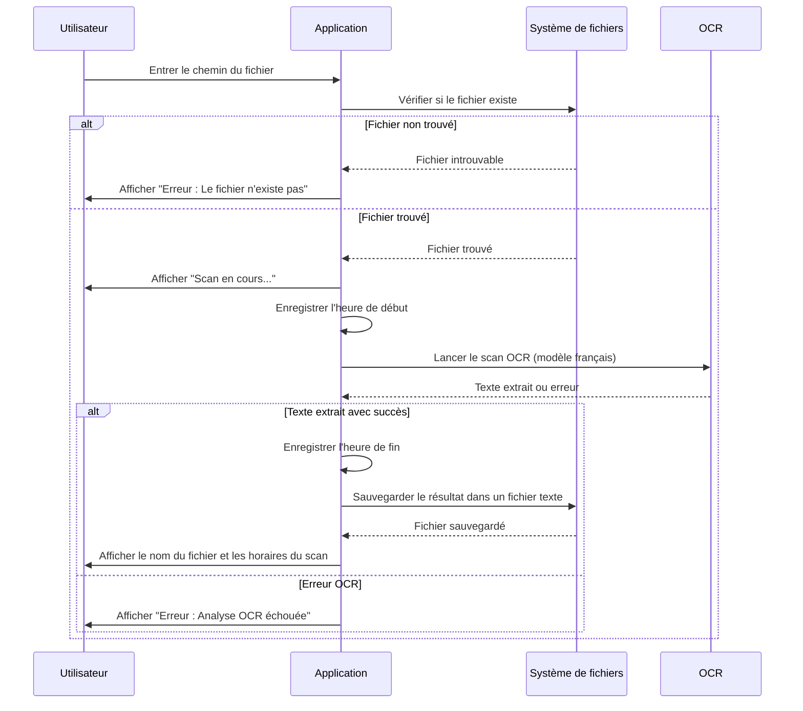
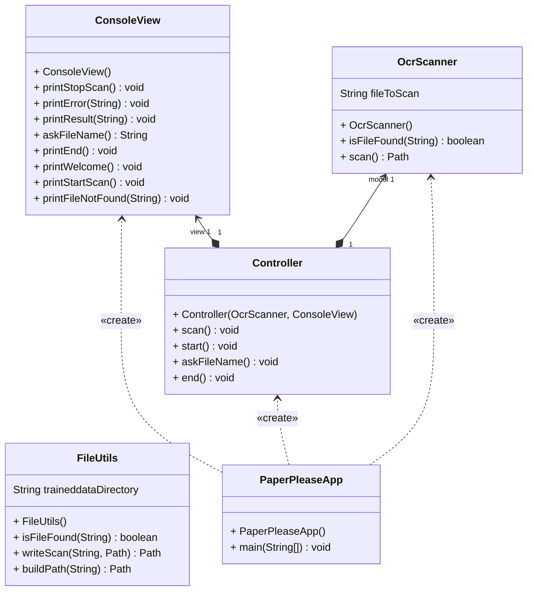

# Exercice 3 - Une brève analyse 

Maintenant que vous connaissez les instructions pour utiliser
Tesseract, réalisez le Proof Of Concept du projet **PaperPlease** en suivant l'analyse ci-dessous.
Si vous vous écartez de cette analyse, notez ces différences dans un document et discutez-en avec votre enseignant·e.

## Description des besoins

Créer une application qui permet à un utilisateur d'effectuer un scan OCR 
sur une image d'une carte étudiant spécifiée par son chemin afin d'en extraire le texte 
français qu'elle contient. L'application doit être robuste.
Une interface simple en ligne de commande doit être mise en place pour cette saisie.

## Flux principal d'utilisation

Afin d'éclaircir la description des besoins, vous trouverez ci-dessous
une description linéaire et simplifiée des étapes qu'un utilisateur suit pour scanner une image.

- Étape 1 : Entrée utilisateur
    - L'utilisateur entre le chemin ou le nom d'un fichier image.
- Étape 2 : Vérification du fichier
    - L'application vérifie l'existence du fichier :
        - Si le fichier n'existe pas, message d'erreur est envoyé et on retourne à l'étape 1.
        - Si le fichier existe, on passe à l'étape suivante.
- Étape 3 : Scan OCR
    - L'application démarre l'analyse OCR et note l'heure de début.
    - Le texte est extrait de l'image.
    - L'application note l'heure de fin.
- Étape 4 : Sauvegarde et affichage
    - Le texte extrait est sauvegardé dans un fichier texte.
    - L'application affiche :
        - Le nom du fichier de sortie.
        - L'heure de début et de fin de l'opération.

## Diagramme de séquence

Si vous préférez un diagramme au lieu du texte, il existe en UML
une représentation dite de séquence qui contient les mêmes informations.

## Diagramme de classes

La décomposition en classes suivante est proposée pour
répondre aux besoins de l'utilisateur.

## Plan de tests

Lorsque vous avez terminé de développer votre application, 
il faut vérifier si elle correspond aux besoins de départ
en testant manuellement celle-ci. Voici les 3 cas à tester pour valider votre travail.

### Cas 1 : Le fichier spécifié n'existe pas

#### Préconditions :
 - L'application est lancée.
 - Le fichier spécifié n'est pas présent sur le disque.

#### Étapes :
 - L'utilisateur entre le chemin d'un fichier inexistant, par exemple : C:\images\inexistant.png.
 - L'application vérifie l'existence du fichier.

#### Résultat attendu : 
 - L'application affiche un message d'erreur : "Erreur : Le fichier spécifié n'existe pas. Veuillez vérifier le chemin."
 - L'utilisateur peut ressaisir un chemin.

### Cas 2 : Le fichier spécifié existe, et l'OCR réussit

#### Préconditions :
 - L'application est lancée.
 - Le fichier spécifié est une image valide, par exemple : C:\images\g12345.png.

#### Étapes :
 - L'utilisateur entre le chemin d'un fichier existant.
 - L'application vérifie l'existence du fichier.
 - L'application exécute l'analyse OCR sur l'image.
 - Le texte extrait est sauvegardé dans un fichier texte (ex. resultat_20250128_141513.txt).
 - L'application affiche :
    - Le nom du fichier de sortie.
    - L'heure de début et de fin de l'analyse.

#### Résultat attendu :
 - L'application indique :
    - "Scan en cours..."
    - "Résultat sauvegardé dans : resultat_20250128_141513.txt"
 -  - L'heure de début et l'heure de fin (ex. 14:15:13).
 - Le fichier resultat_20250128_141513.txt contient le texte extrait.
 
### Cas 3 : Le fichier spécifié est illisible par l'OCR

#### Préconditions :
 - L'application est lancée.
 - Le fichier spécifié existe mais contient une image sans texte reconnaissable, par exemple : C:\images\vide.png.

#### Étapes :
 - L'utilisateur entre le chemin d'un fichier existant.
 - L'application vérifie l'existence du fichier.
 - L'application exécute l'analyse OCR sur l'image.
 - L'OCR échoue à extraire du texte.

#### Résultat attendu :
 - L'application affiche un message d'erreur : "Erreur : L'analyse OCR a échoué. L'image ne contient pas de texte lisible."
 - Aucun fichier texte n'est généré.
